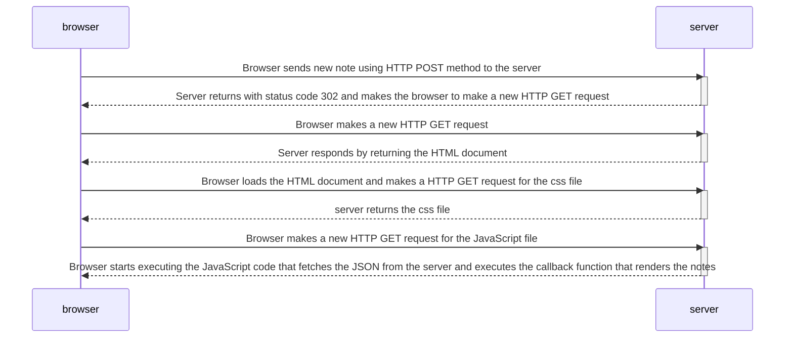

```mermaid
sequenceDiagram
    participant browser
    participant server
    
    browser->>server: Browser sends new note using HTTP POST method to the server
    activate server
    server-->>browser: Server returns with status code 302 and makes the browser to make a new HTTP GET request
    deactivate server
    
    browser->>server: Browser makes a new HTTP GET request
    activate server
    server-->>browser: Server responds by returning the HTML document
    deactivate server
    
    browser->>server: Browser loads the HTML document and makes a HTTP GET request for the css file
    activate server
    server-->>browser: server returns the css file
    deactivate server
       
    browser->>server: Browser makes a new HTTP GET request for the JavaScript file
    activate server
    server-->>browser: Browser starts executing the JavaScript code that fetches the JSON from the server and executes the callback function that renders the notes
    deactivate server    
```